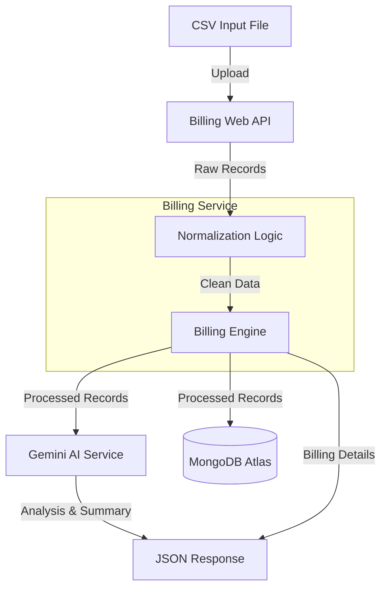

# AI-Powered Billing Automation System

## 1. Project Overview
This system automates the processing of customer billing data. It reads raw CSV inputs, validates and normalizes the data, calculates bill amounts based on plan tiers, saves records to a **MongoDB** database, and uses **Google Gemini AI** to generate operational insights.

## 2. Architecture Diagram


## 3. Deployment Flow & Logic
1.  **Workato** detects a new CSV file and Transforms it into a JSON Array.
2.  **Workato** sends a `POST` request to the API.
    *   *Note*: The integration to expose the local API via **ngrok** is currently **in progress**. While the core API is fully functional and tested locally, the public tunnel setup requires further configuration for production stability.
3.  **API** processes the data:
    *   **Normalization Logic**: Validates and standardizes input data (e.g., mapping "Plan A" to "Basic").
    *   **Gemini AI Service**: Analyzes the normalized data for anomalies and suggests categorizations.
    *   **Billing Engine**: Calculates final bill amounts based on the standardized plans.
    *   **Database Insertion**: Saves the validated records and AI analysis logs to MongoDB.
4.  **Humans** view the results via:
    *   MongoDB Atlas Dashboard.
    *   API Endpoint: `/api/billing/analysis` (for AI logs).

## 4. Data Schema (MongoDB/Logical)

### CustomerMaster
Stores unique customer details.
*   `CustomerId` (PK)
*   `Plan` (Basic, Standard, Premium)
*   `CityRegion`

### CustomerUsage
Stores individual billing events.
*   `UsageId` (PK)
*   `CustomerId` (FK)
*   `TotalUsage`
*   `CalculatedBillAmount`
*   `ProcessedDate`

### BatchAnalysisLog
Stores the AI-generated summaries for each batch.
*   `Id` (PK)
*   `ProcessedAt`
*   `AiAnalysis` (JSON Document containing suspicious records and summaries)

## 5. How to Run Locally

### Prerequisites
*   .NET 9.0 SDK
*   MongoDB Atlas Connection String
*   Google Gemini API Key

### Configuration
Update `appsettings.json` with your keys:
```json
"Gemini": { "ApiKey": "YOUR_KEY" },
"MongoDB": { "ConnectionString": "YOUR_MONGO_URI" }
```

### Start Server
```powershell
dotnet run
```

### Test Data
Run the included PowerShell script to simulate a Workato payload:
```powershell
.\test_csv_data.ps1
```
